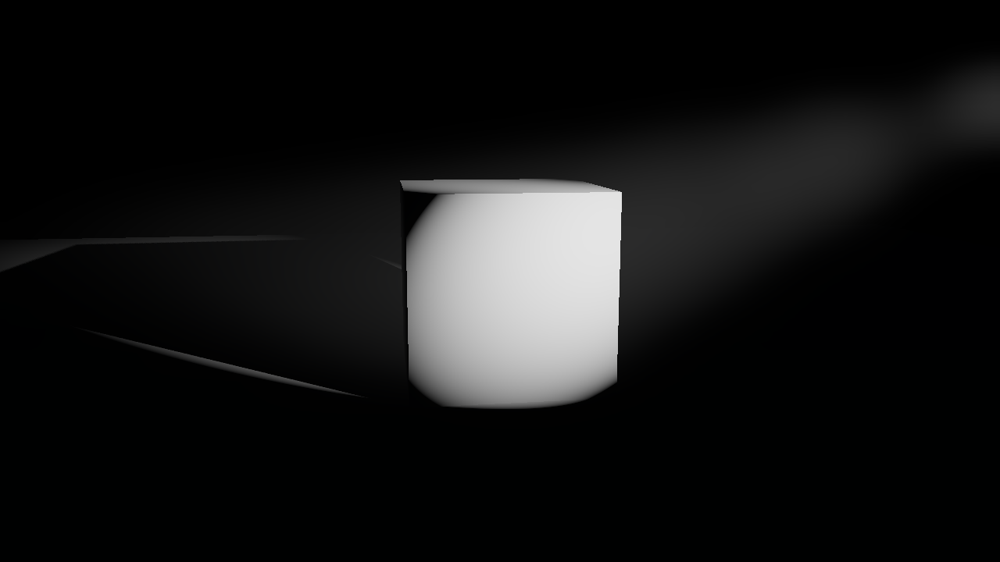

# Phase 0: environment report

Generated 2026-09-28 08:28 UTC by `tools/setup/smoke_test.sh`.

## Machine

- OS: Ubuntu 24.04.4 LTS
- CPUs: 4; RAM: 15 GB; GPU: none (software rendering)
- Vulkan device: llvmpipe (LLVM 20.1.2, 256 bits)

## Toolchain

- Godot: 4.7.2.stable.custom_build.ed1daf0bf
- Blender: Blender 5.2.2 LTS (hash d13f752e3b9c built 2026-09-15 01:34:58)
- MPFB: 2.0.17
- Git LFS: git-lfs/3.4.1
- ffmpeg: 6.1.1-3ubuntu5

## Checks

- Godot Forward+ render under Xvfb: `smoke: renderer=forward_plus | adapter=llvmpipe (LLVM 20.1.2, 256 bits) | api=1.4.318 | agx=true | 1280x720 | save=OK`
- Render wall time, including engine start-up and 12 frames: 19.2 s
- MPFB: `mpfb_smoke: created "Human" with 19158 vertices and 9 shape keys in 2.8s`

